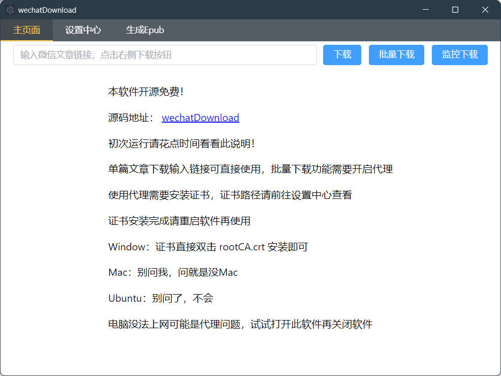
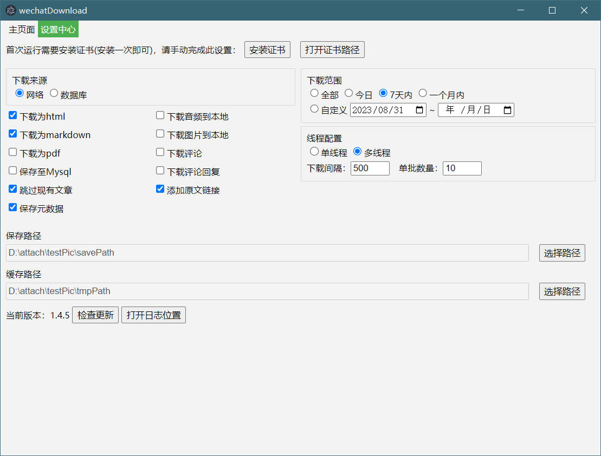
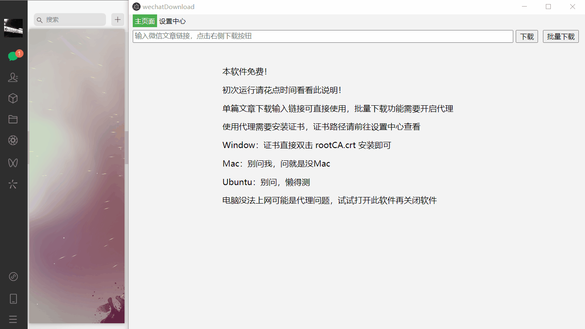
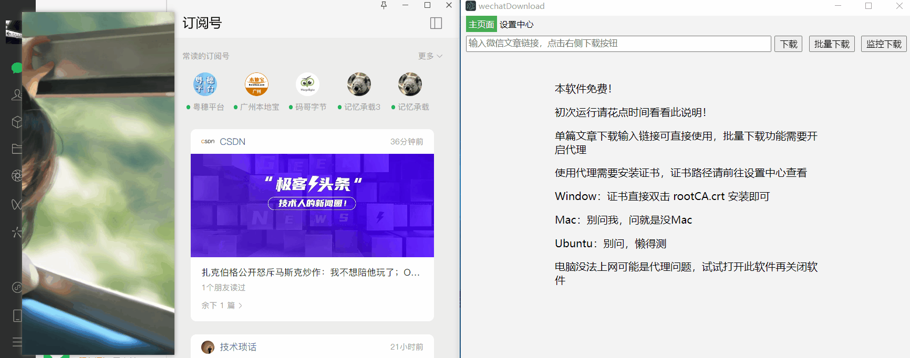

# wechatDownload

微信公众号文章下载工具

此仓库已停止维护，感谢使用。

## 前言

能来 github 的，我默认都是友好的技术人员。大家提 issues 前，请确保你已经按照下面的说明正确安装证书。在 issues 中详细描述清楚你的环境（系统版本、软件版本、数据库版本等）和遇到的问题，并附上日志（设置中心->打开日志位置）

参考：[提问的智慧](https://github.com/tvvocold/How-To-Ask-Questions-The-Smart-Way)

## 项目介绍

### 技术栈

Electron + Typescript + VUE3

### 原理

获取微信公号文章列表，需要 3 个特殊参数：

- \_biz：公众号的 id
- uin：微信用户的 ID
- key：不知道是啥

这 3 个参数通过 http 代理获取，剩下的就是普通爬虫的做法了

### 使用





- 单篇文章下载

  直接输入链接，点击下载按钮即可

  此方式无需登录微信，也因此无法获取评论和文章中QQ音乐音频，如需要这两样数据，请使用批量下载或监控下载

- 批量下载

  1. 初次使用请安装证书,
     
      - 自动安装（仅限window系统）
      
        需要管理员权限（右击软件图标 -> 以管理员身份运行）
      
        设置中心 → 安装证书
      
      - 手动安装
      
        设置中心 → 打开证书路径 → 打开rootCA.crt文件
        
      
  2. 需要安装电脑版微信

  3. 点击**批量下载**按钮，开始监听微信公号数据

  4. 在电脑版微信打开一篇需要下载的公号的文章

  5. 回到WechatDownload，会弹框提示
      

- 监控下载

  1. 需要安装电脑版微信
  
  2. 在WechatDownload点击**监控下载**按钮（按钮会变颜色）
  
  3. 在电脑版微信打开需要下载的文章（可以打开多篇文章）
  
  4. 回到WechatDownload，再次点击**监控下载**按钮即可开始下载
  
     
  
- 保存至 MySql

  需要执行 /doc/mysql.sql 文件中的 SQL 语句创建表
  
- 线程配置

  时间间隔：单位是毫秒，假设时间间隔500，单线程是下载完一篇文章，等待500毫秒再继续下载。多线程就是每500毫秒异步下载文章，无需等待上一篇文章下载完成。

  单批数量：假设单批数量10，每次会同时异步下载10篇文章，等待这10篇下载完成，再继续下载10篇。

- 过滤规则

  目前支持对标题和作者进行关键词过滤

  ```json
  {
      "title": {
          "include": ["包含关键词1", "包含关键词2"],
          "exclude": ["排除关键词1","排除关键词2"]
      },
      "auth": {
          "include": ["包含关键词1", "包含关键词2"],
          "exclude": ["排除关键词1", "排除关键词2"]
      }
  }
  ```
  
  举例子，如果需要作者是 张三 并且标题包含 好人，那就是
  
  ```json
  {
      "title": {
          "include": ["好人"]
      },
      "auth": {
          "include": ["张三"]
      }
  }
  ```
  
- 生成Epub

  支持通过 HTML 文件生成 Epub 电子书，所以使用需要先使用**批量下载**将公众号文章保存到本地，再生成 Epub

  使用参数如下

  - 文件名：必要参数。例如填写 **test**，最后就会生成 **test.epub** 文件

  - 文件夹：必要参数。保存了 HTML 文件的文件夹，也就是 Epub 的数据来源
  - 封面图片：Epub 文件的封面图片，支持 jpg、png 格式

### 功能

设置中心有啥就支持啥

- 支持选择下载范围
- 将网页抓换成HTML、Markdown、PDF
- 将网页源码保存至Mysql（下载来源是网络才有效）
- 下载图片、音频到本地
- 添加原文链接、元数据（作者、时间、公号名）
- 跳过现有文章
- 下载评论
- 下载来源（此选项只影响批量下载）：
- 网络：就是从微信接口获取文章
- 数据库：如果选择了**保存至Mysql**选项，数据库中会保存文章的网页源码，此时如果需要将源码转换成HTML、Markdown ，选择下载来源是数据库即可。（微信接口用得多会被限制）

## 源码运行&编译

### 安装

```bash
$ npm install
```

### 调试

```bash
$ npm run dev
```

### 编译

```bash
# For windows
$ npm run build:win

# For macOS
$ npm run build:mac

# For Linux
$ npm run build:linux
```

## 特别感谢

[](https://www.jetbrains.com/?from=wechatDownload)

感谢 [JetBrains](https://www.jetbrains.com/?from=wechatDownload) 提供的开源开发许可证